# Student Course Registration Portal

A full-stack web application that simulates a university's course registration portal. Students can view available courses, register for courses, update their registration, and deregister from courses.

## Setup Instructions

1.  **Install backend dependencies:**
    ```bash
    cd backend
    npm install
    ```
2.  **Start the backend server:**
    ```bash
    npm start
    ```
    This command runs the `server.js` file using Node.js, and your backend API will be accessible on `http://localhost:3000`.

## Access the Frontend

    The frontend of this application is designed to be served from a local development server. To access the frontend pages, ensure your backend server is running, and then use the following URLs in your web browser:


* **Course Listing and Registration:** `http://127.0.0.1:5500/frontend/index.html`
* **Student Registrations:** `http://127.0.0.1:5500/frontend/students.html`
* **Update Registration:** `http://127.0.0.1:5500/frontend/update.html`

* **Course Listing and Registration**: 
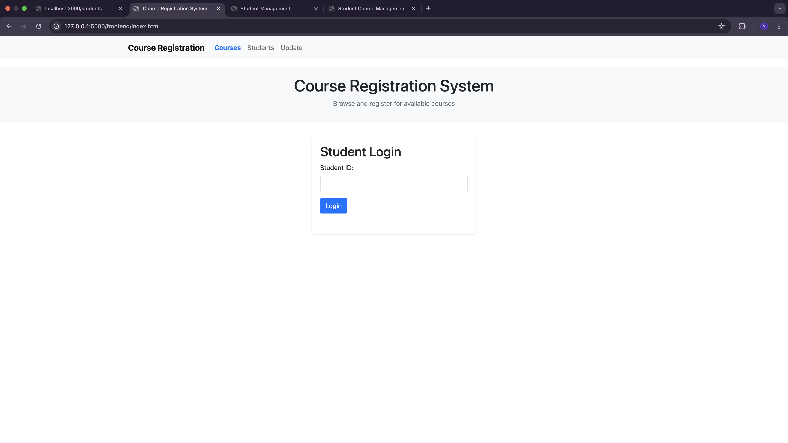
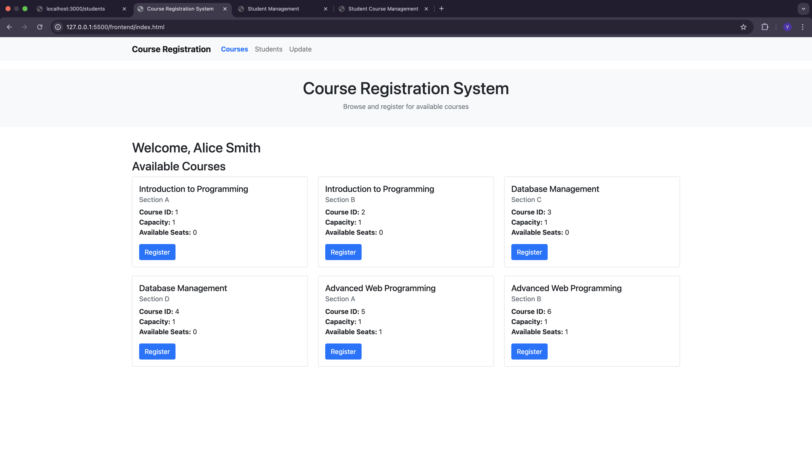

* **Student Registrations**:
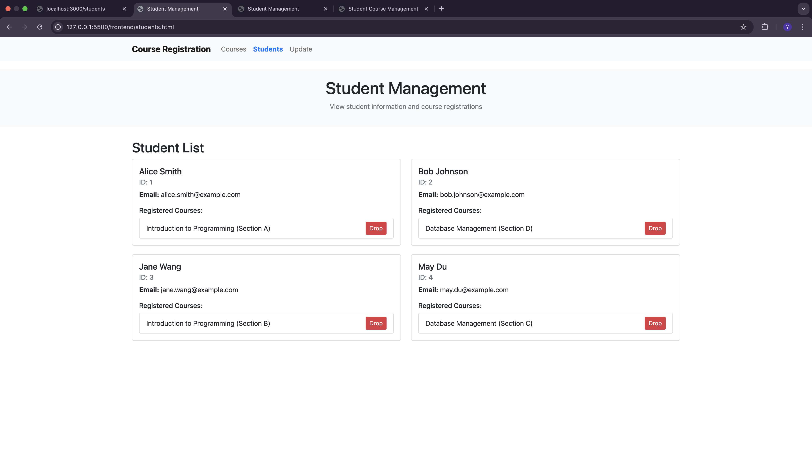

* **Update Registration**:

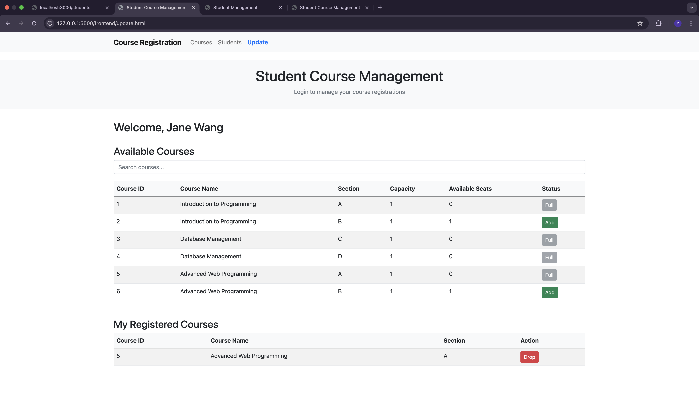
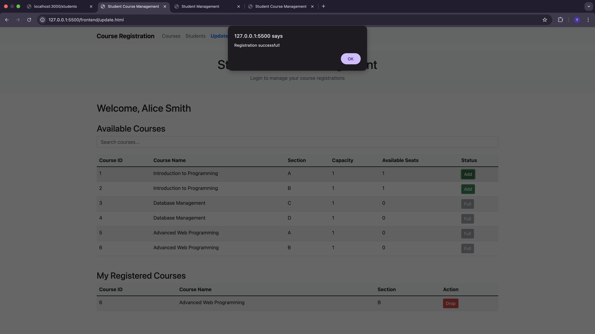
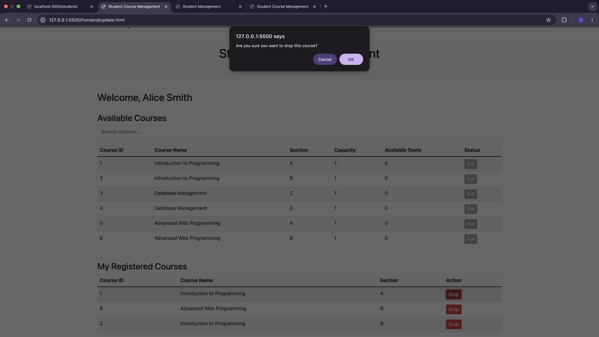
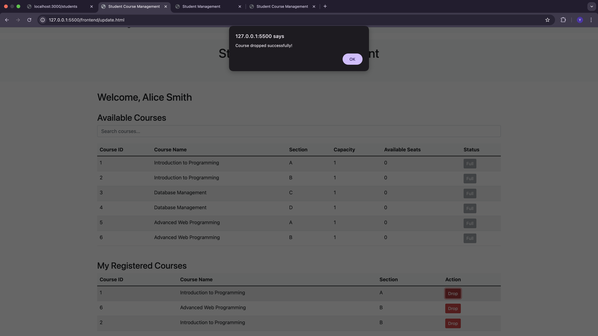
## API Routes & Sample Requests

The backend API provides the following endpoints:

* **`GET /courses`**: List all available courses.
    * **Sample Request:** `http://localhost:3000/courses`
    * **Sample Request (Postman)**
    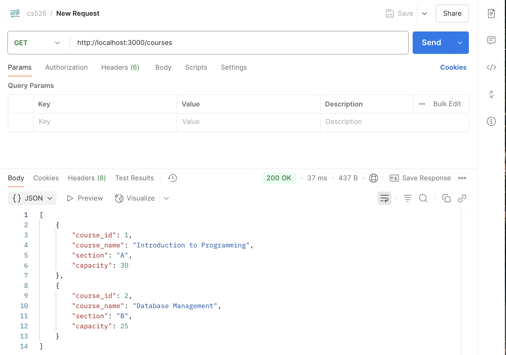


* **`GET /students`**: List all students.
    * **Sample Request:** `http://localhost:3000/students`
    * **Sample Response:**
    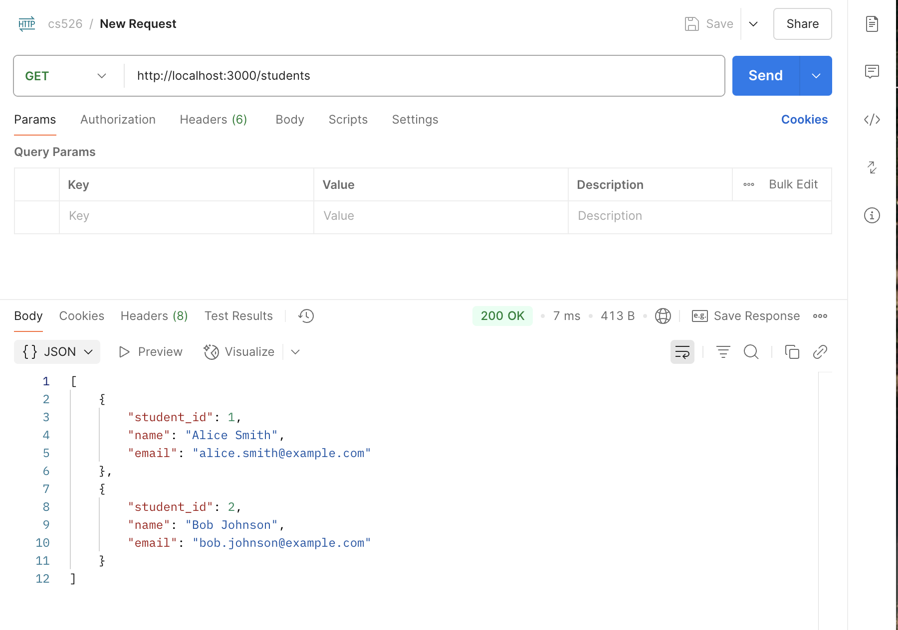


* **`POST /register`**: Register a student for a course.
* **Sample Request:** `http://localhost:3000/rigister`
    * **Sample Response:**
    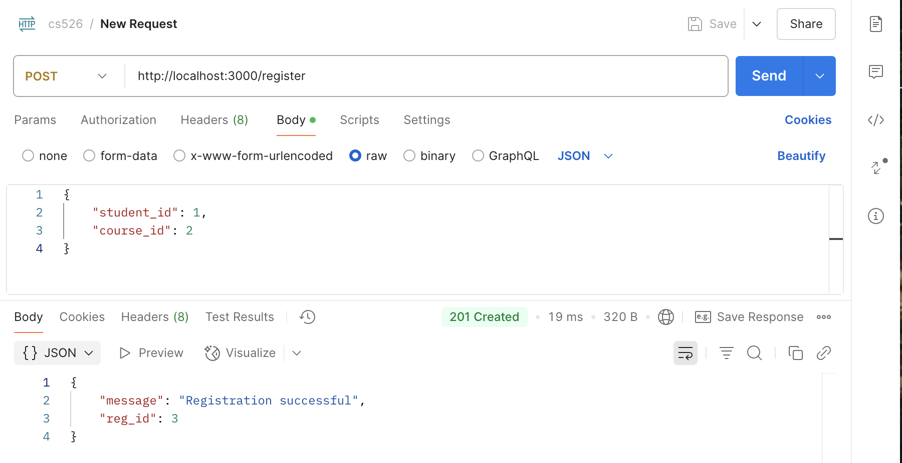


* **`PUT /update-registration`**: Update a student's course registration.
* **Sample Request:** `http://localhost:3000/update-registration`
    * **Sample Response:**
    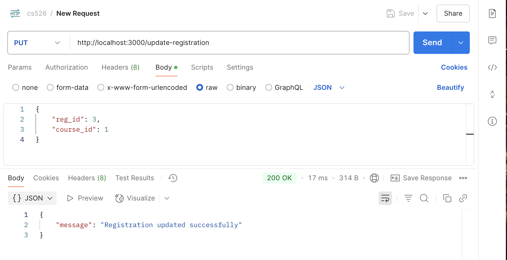

* **`DELETE /deregister/:reg_id`**: Remove a course registration.
* **Sample Request:** `http://localhost:3000/deregister/3`
    * **Sample Response:**
    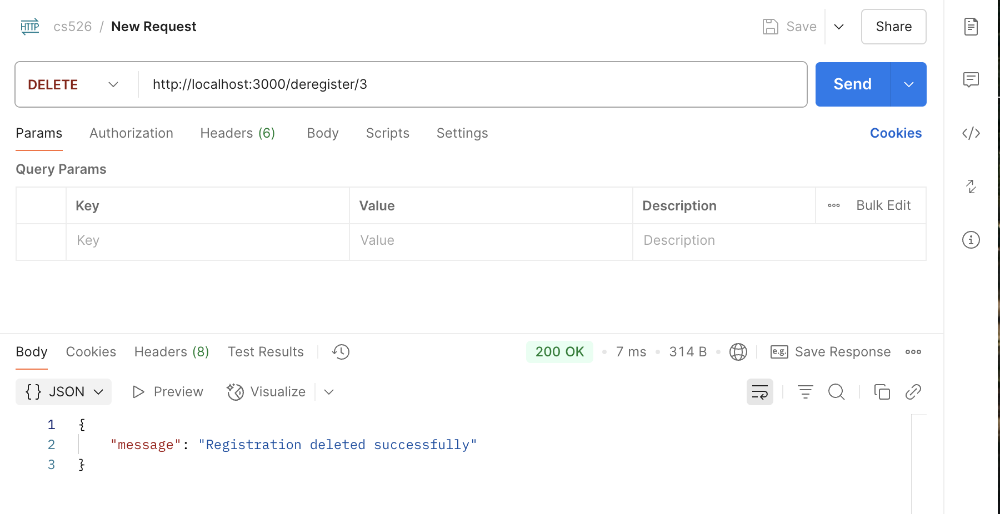

* **`GET /export/registrations`**: Export registration data as a CSV file.
* **Sample Request:** `http://localhost:3000/export/registrations`
    * **Sample Response:**
        The browser will download a CSV file named `registrations.csv`. The file will contain the following columns: `reg_id`, `student_id`, `student_name`, `email`, `course_id`, `course_name`, and `section`.


## Assumptions Made or Known Limitations

* **Basic UI:** The frontend styling (`style.css`) is minimal and intended for basic functionality and clean presentation.
* **No Advanced Features:** The application does not include authentication, authorization, real-time updates, or the optional real-world features mentioned in the assignment (e.g., capacity checks, available seats, login system, data export, email confirmation).
* **Error Handling:** Backend error handling provides basic messages and status codes. More specific error handling could be implemented.
* **Frontend Data Fetching for Students:** The `students.html` page currently lists students but does not fully display their registered courses due to the absence of a specific backend API endpoint to retrieve registrations for a given student with course details. This would require an additional API endpoint and corresponding frontend logic.